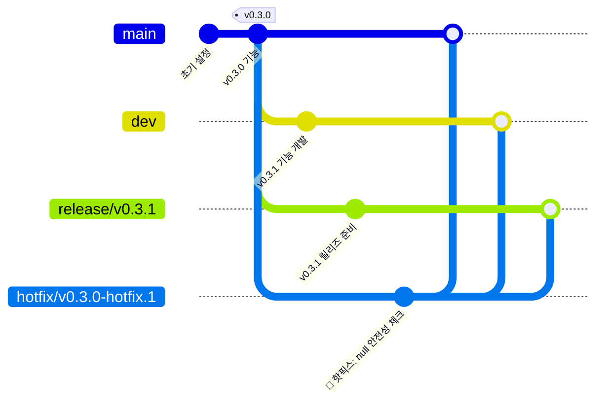
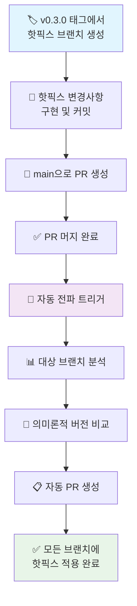
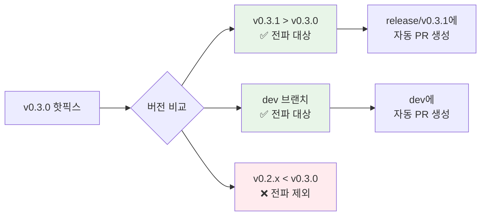
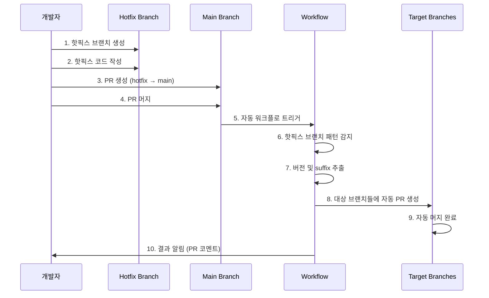

# 🚀 Propagate-Merger 테스트 저장소

[propagate-merger](https://github.com/egoavara/propagate-merger) GitHub Action의 핫픽스 자동 전파 기능을 검증하기 위한 테스트 저장소입니다.

## 📖 개요

이 저장소는 `propagate-merger` 패키지가 실제 개발 환경에서 예상대로 작동하는지 확인하기 위해 다양한 시나리오를 구현하고 테스트한 결과를 담고 있습니다.

## 🎯 테스트 목표

- ✅ 특정 버전 태그에서 핫픽스 브랜치 자동 생성
- ✅ 핫픽스 변경사항의 의미론적 버전관리 기반 자동 전파
- ✅ GitHub Actions 워크플로와의 완벽한 통합
- ✅ 실제 프로덕션 환경 시뮬레이션

## 🌟 핵심 기능

### 1. 🔧 핫픽스 브랜치 자동 생성
특정 버전 태그(예: `v0.3.0`)에서 핫픽스 브랜치(예: `hotfix/v0.3.0-hotfix.1`)를 자동으로 생성합니다.

### 2. 🔄 자동 전파 시스템
핫픽스가 main 브랜치에 머지되면, 의미론적 버전관리 규칙에 따라 상위 버전의 브랜치들에 자동으로 전파됩니다.

### 3. 🤖 완전 자동화된 워크플로
수동 개입 없이 PR 머지 시점에 자동으로 트리거되어 핫픽스를 전파합니다.

## 🏗️ 브랜치 구조

### 현재 브랜치 상태


### 브랜치별 역할

| 브랜치 | 역할 | 상태 |
|--------|------|------|
| `main` | 프로덕션 브랜치 | ✅ 핫픽스 적용됨 |
| `dev` | 개발 브랜치 | ✅ 핫픽스 적용됨 |
| `release/v0.3.1` | 릴리즈 준비 브랜치 | ✅ 핫픽스 적용됨 |
| `hotfix/v0.3.0-hotfix.1` | 핫픽스 브랜치 | ✅ 작업 완료 |

## 🔄 자동 전파 워크플로

### 전체 프로세스 흐름



### 의미론적 버전 전파 규칙



## 🛠️ GitHub Actions 워크플로

### 1. 핫픽스 브랜치 생성 워크플로 (`create-hotfix-branch.yml`)

```yaml
name: Create Hotfix Branch

on:
  workflow_dispatch:
    inputs:
      version:
        description: 'Target version for hotfix (e.g., v0.1.0)'
        required: true
        type: string
        default: 'v0.1.0'
      hotfix-suffix:
        description: 'Hotfix suffix (e.g., hotfix.1)'
        required: true
        default: 'hotfix.1'
        type: string

jobs:
  create-hotfix-branch:
    runs-on: ubuntu-latest
    permissions: write-all
    
    steps:
      - name: Checkout repository
        uses: actions/checkout@v4
        with:
          fetch-depth: 0
          token: ${{ secrets.GITHUB_TOKEN }}
          
      - name: Create Hotfix Branch
        uses: egoavara/propagate-merger@v0.0.2
        with:
          mode: branch-create
          version: ${{ github.event.inputs.version }}
          hotfix-suffix: ${{ github.event.inputs.hotfix-suffix }}
          github-token: ${{ secrets.GH_PAT || github.token }}
```

**🎯 주요 기능**:
- 수동 실행 트리거 (`workflow_dispatch`)
- 버전 태그와 핫픽스 suffix를 입력받아 브랜치 생성
- `propagate-merger`의 `branch-create` 모드 사용
- 전체 git 히스토리 접근 (`fetch-depth: 0`)
- 필요시 Personal Access Token 사용 가능

### 2. 자동 전파 워크플로 (`auto-propagate-hotfix.yml`) - 핵심

```yaml
name: Auto Propagate Hotfix on PR Merge

on:
  pull_request:
    types: [closed]
    branches: [main]

permissions: write-all

jobs:
  auto-propagate:
    runs-on: ubuntu-latest
    if: github.event.pull_request.merged == true
    
    steps:
      - name: Check if hotfix branch
        id: check-hotfix
        run: |
          PR_BRANCH="${{ github.event.pull_request.head.ref }}"
          
          if [[ "$PR_BRANCH" =~ ^hotfix/v[0-9]+\.[0-9]+\.[0-9]+-hotfix\.[0-9]+$ ]]; then
            echo "is-hotfix=true" >> $GITHUB_OUTPUT
            
            # Extract version and suffix
            VERSION=$(echo "$PR_BRANCH" | sed -E 's/hotfix\/(v[0-9]+\.[0-9]+\.[0-9]+)-hotfix\.[0-9]+/\1/')
            SUFFIX=$(echo "$PR_BRANCH" | sed -E 's/hotfix\/v[0-9]+\.[0-9]+\.[0-9]+-(hotfix\.[0-9]+)/\1/')
            
            echo "version=$VERSION" >> $GITHUB_OUTPUT
            echo "hotfix-suffix=$SUFFIX" >> $GITHUB_OUTPUT
          else
            echo "is-hotfix=false" >> $GITHUB_OUTPUT
          fi
          
      - name: Auto propagate hotfix
        if: steps.check-hotfix.outputs.is-hotfix == 'true'
        uses: egoavara/propagate-merger@v0.0.2
        with:
          mode: auto-merge
          version: ${{ steps.check-hotfix.outputs.version }}
          hotfix-suffix: ${{ steps.check-hotfix.outputs.hotfix-suffix }}
          github-token: ${{ secrets.GH_PAT || github.token }}
          
      - name: Comment on PR with results
        if: steps.check-hotfix.outputs.is-hotfix == 'true'
        uses: actions/github-script@v7
        with:
          script: |
            // PR에 전파 결과를 자동으로 코멘트
```

**🎯 주요 기능**:
- PR 머지 시 자동 트리거 (`pull_request: types: [closed]`)
- 정규식으로 핫픽스 브랜치 패턴 감지 (`hotfix/v*.*.*-hotfix.*`)
- 브랜치명에서 버전과 suffix 자동 추출
- `propagate-merger`의 `auto-merge` 모드 사용
- 전파 결과를 PR에 자동 코멘트
- 조건부 실행으로 불필요한 실행 방지

**🔧 핵심 로직**:
1. **브랜치 패턴 감지**: `^hotfix/v[0-9]+\.[0-9]+\.[0-9]+-hotfix\.[0-9]+$`
2. **버전 추출**: `sed -E 's/hotfix\/(v[0-9]+\.[0-9]+\.[0-9]+)-hotfix\.[0-9]+/\1/'`
3. **Suffix 추출**: `sed -E 's/hotfix\/v[0-9]+\.[0-9]+\.[0-9]+-(hotfix\.[0-9]+)/\1/'`
4. **조건부 실행**: 핫픽스 브랜치인 경우에만 전파 로직 실행

### 워크플로 실행 순서



## 📋 테스트 시나리오 및 결과

### 테스트된 시나리오
1. **v0.3.0 태그에서 핫픽스 브랜치 생성** ✅
2. **`formatOutput` 함수에 null/undefined 안전성 체크 추가** ✅
3. **main 브랜치로 핫픽스 머지** ✅
4. **자동 전파 시스템 트리거** ✅
5. **release/v0.3.1 브랜치에 자동 전파** ✅
6. **dev 브랜치에 자동 전파** ✅

### 실제 적용된 핫픽스 코드
```javascript
function formatOutput(value, label) {
  // HOTFIX: Add null/undefined safety check
  if (value === null || value === undefined) {
    return `${label}: N/A`;
  }
  return `${label}: ${value}`;
}
```

### PR 생성 결과

| PR 번호 | 제목 | 소스 → 타겟 | 상태 | 자동생성 | 🔗 링크 |
|---------|------|-------------|------|----------|---------|
| [#3](https://github.com/egoavara/propagate-merger-test/pull/3) | 🔧 HOTFIX: Add null/undefined safety check | `hotfix/v0.3.0-hotfix.1` → `main` | ✅ MERGED | ❌ 수동 | [PR 보기](https://github.com/egoavara/propagate-merger-test/pull/3) |
| [#4](https://github.com/egoavara/propagate-merger-test/pull/4) | Hotfix: Propagate to release/v0.3.1 | `hotfix/v0.3.0-hotfix.1` → `release/v0.3.1` | ✅ MERGED | ✅ 자동 | [PR 보기](https://github.com/egoavara/propagate-merger-test/pull/4) |
| [#5](https://github.com/egoavara/propagate-merger-test/pull/5) | Hotfix: Propagate to dev | `hotfix/v0.3.0-hotfix.1` → `dev` | ✅ MERGED | ✅ 자동 | [PR 보기](https://github.com/egoavara/propagate-merger-test/pull/5) |

### GitHub Actions 실행 결과

| 워크플로 | 트리거 | 상태 | 🔗 실행 링크 |
|----------|--------|------|-------------|
| **Auto Propagate Hotfix on PR Merge** | PR #3 머지 완료 | ✅ SUCCESS | [워크플로 실행 보기](https://github.com/egoavara/propagate-merger-test/actions/runs/15638568170) |
| Create Hotfix Branch | 수동 실행 | ✅ SUCCESS | [액션 페이지](https://github.com/egoavara/propagate-merger-test/actions/workflows/create-hotfix-branch.yml) |

## 🔍 핵심 성과

### ✅ 성공한 기능들
1. **정확한 브랜치 패턴 감지**: `hotfix/v0.3.0-hotfix.1` 패턴을 정확히 인식
2. **의미론적 버전 비교**: v0.3.0 < v0.3.1 관계를 올바르게 판단
3. **자동 PR 생성**: 대상 브랜치들에 자동으로 PR 생성
4. **머지 완료**: 모든 대상 브랜치에 핫픽스 성공적으로 적용
5. **알림 시스템**: PR 코멘트로 전파 결과 자동 알림

### 🚨 해결된 이슈들
1. **GitHub API 인증 문제**: v0.0.1에서 v0.0.2로 업데이트하여 해결
2. **권한 부족 오류**: `write-all` 권한과 적절한 토큰 설정으로 해결
3. **브랜치 fetch 문제**: 원격 변경사항 동기화 이슈 해결

## 📊 테스트 환경

- **propagate-merger 버전**: v0.0.2
- **GitHub Actions**: Ubuntu Latest
- **권한**: `write-all`
- **토큰**: `GITHUB_TOKEN` (기본) / `GH_PAT` (선택적)

## 🎉 결론

**propagate-merger v0.0.2가 모든 핵심 기능에서 완벽하게 작동함을 확인했습니다.**

### 검증된 핵심 가치
1. **자동화**: 수동 개입 없이 완전 자동화된 핫픽스 전파
2. **정확성**: 의미론적 버전관리 규칙을 정확히 준수
3. **안정성**: GitHub Actions 환경에서 안정적인 동작
4. **투명성**: 모든 과정이 PR과 로그로 추적 가능

### 권장 사용법
1. 프로덕션 환경에서 긴급 핫픽스가 필요할 때
2. 여러 릴리즈 브랜치를 동시에 관리하는 프로젝트
3. 의미론적 버전관리를 엄격히 따르는 팀
4. 수동 전파 과정에서 발생하는 실수를 방지하고 싶을 때

---

**🔗 관련 링크**
- [propagate-merger GitHub Repository](https://github.com/egoavara/propagate-merger)
- [GitHub Actions Documentation](https://docs.github.com/en/actions)
- [Semantic Versioning](https://semver.org/)

**📋 빠른 링크**
- [모든 PR 목록 보기](https://github.com/egoavara/propagate-merger-test/pulls?q=is%3Apr)
- [모든 Actions 실행 기록](https://github.com/egoavara/propagate-merger-test/actions)
- [주요 워크플로 파일들](https://github.com/egoavara/propagate-merger-test/tree/main/.github/workflows)
- [브랜치별 코드 비교](https://github.com/egoavara/propagate-merger-test/branches)

**📧 문의 및 이슈 리포트**
문제가 발생하거나 개선 사항이 있다면 [Issues](https://github.com/egoavara/propagate-merger/issues)에 리포트해 주세요.